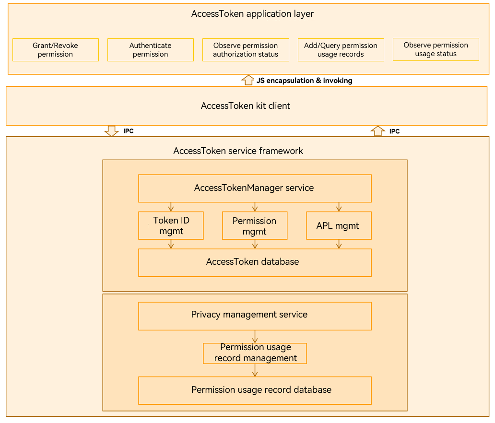

# ATM


## Introduction

AccessTokenManager (ATM) implements unified app permission management based on access tokens on OpenHarmony.

The access token information of an app includes the app identifier (**APPID**), user ID, app twin index, app Ability Privilege Level (APL), and permission information. The access token of each app is identified by a 32-bit token identity (**TokenID**) in the device.

The ATM module provides the following functions:
-   Verifying app permissions based on the token ID before an app accesses sensitive data or calls an API.
-   Obtaining access token information (for example, APL) based on the token ID.

The following figure shows the ATM architecture.


## Directory Structure

```
/base/security/access_token
├── frameworks                  # Code of basic functionalities.
│   ├── accesstoken             # Code of the ATM framework.
│   ├── common                  # Common code.
│   ├── privacy                 # Code of the privacy framework.
│   └── tokensync               # Code of the access token synchronization framework.
├── interfaces                  # Interfaces
│   ├── innerkits               # Internal interfaces.
│   │   ├── accesstoken         # Code of the internal access token interfaces.
│   │   ├── nativetoken         # Code of the internal native token interfaces.
│   │   ├── privacy             # Code of the internal privacy interfaces.
│   │   ├── token_callback      # Code of the internal callbacks.
│   │   ├── token_setproc       # Code of internal interfaces for exchanging token IDs.
│   │   └── tokensync           # Code of the internal access token synchronization interfaces.
│   └── kits                    # External interfaces.
│   │   ├── accesstoken         # Code of the external access token interfaces.
│   │   ├── common              # Common code of external interfaces.
│   │   └── privacy             # Code of the external privacy interfaces.
└── services                    # Services
    ├── accesstokenmanager      # ATM service code.
    ├── privacymanager          # Privacy manager service code.
    └── tokensyncmanager        # Code of the access token synchronization service. 

```

## Usage
### Available APIs

| **API**| **Description**|
| --- | --- |
| AccessTokenIDEx AllocHapToken(const HapInfoParams& info, const HapPolicyParams& policy); | Allocates a token ID to an app.|
| AccessTokenID AllocLocalTokenID(const std::string& remoteDeviceID, AccessTokenID remoteTokenID); | Allocates a local token ID to the app of a remote device.|
| int UpdateHapToken(AccessTokenIDEx& tokenIdEx, bool isSystemApp, const std::string& appIDDesc, int32_t apiVersion, const HapPolicyParams& policy); | Updates token information.|
| int DeleteToken(AccessTokenID tokenID); | Deletes the app's token ID and information.|
| int GetTokenType(AccessTokenID tokenID); | Obtains the type of an access token.|
| int GetTokenTypeFlag(AccessTokenID tokenID); | Obtains the type of a trusted token ID.|
| int GetTokenType(FullTokenID tokenID); | Obtains the type of an access token.|
| int GetTokenTypeFlag(FullTokenID tokenID); | Obtains the type of a trusted token ID.|
| int CheckNativeDCap(AccessTokenID tokenID, const std::string& dcap); | Checks whether the native process corresponding to the given token ID has the specified distributed capability.|
| AccessTokenID GetHapTokenID(int32_t userID, const std::string& bundleName, int32_t instIndex); | Obtains the token ID of an app.|
| AccessTokenIDEx GetHapTokenIDEx(int32_t userID, const std::string& bundleName, int32_t instIndex); | Obtains the token ID of an app.|
| int GetHapTokenInfo(AccessTokenID tokenID, HapTokenInfo& hapTokenInfoRes); | Obtains the token information about an OpenHarmony Ability Package (HAP).|
| int GetNativeTokenInfo(AccessTokenID tokenID, NativeTokenInfo& nativeTokenInfoRes); | Obtains the native token information.|
| int VerifyAccessToken(AccessTokenID tokenID, const std::string& permissionName); | Checks whether an access token has the specified permission.|
| int GetDefPermission(const std::string& permissionName, PermissionDef& permissionDefResult); | Obtains definition information about the specified permission.|
| int GetDefPermissions(AccessTokenID tokenID, std::vector&lt;PermissionDef&gt;& permList); | Obtains the permission definition set of a HAP.|
| int GetReqPermissions(AccessTokenID tokenID, std::vector&lt;PermissionStateFull&gt;& reqPermList, bool isSystemGrant); | Obtains the status set of the permission requested by a HAP.|
| int GetPermissionFlag(AccessTokenID tokenID, const std::string& permissionName); | Obtains the permissions of the app with the specified token ID.|
| int GrantPermission(AccessTokenID tokenID, const std::string& permissionName, int flag); | Grants a permission to the app with the specified token ID.|
| int RevokePermission(AccessTokenID tokenID, const std::string& permissionName, int flag); | Revokes a permission from the app with the specified token ID.|
| int ClearUserGrantedPermissionState(AccessTokenID tokenID); | Clears the user_grant permission status of the app with the specified token ID.|
| uint64_t GetAccessTokenId(const char *processname, const char **dcap, int32_t dacpNum, const char *aplStr); | Obtains the token ID of a native process.|

### How to Use
ATM provides unified access control for apps and allows apps or service abilities to obtain and verify app permissions and APL. The ATM APIs can be called by a service ability started by a native process or an app HAP.

#### Native Process
-  Before a native process starts, it calls **GetAccessTokenId** to obtain a token ID, and then calls **SetSelfTokenID** to set the token ID to the kernel.
-  During the running of a native process, it calls **GetNativeTokenInfo** or **CheckNativeDCap** to obtain the token information, including the distributed capability and APL.

#### App HAP
-  When an app is installed, **AllocHapToken** is called to obtain the token ID of the app.
-  When an authentication is required during app running, **VerifyAccessToken** or **GetReqPermissions** is called to obtain and verify the app permissions and APL.
-  When an app is uninstalled, **DeleteToken** is called to delete the related access token information.

## Repositories Involved

[startup\_init\_lite](https://gitee.com/openharmony/startup_init_lite)

[security\_device\_auth](https://gitee.com/openharmony/security_device_auth)

**[security\_access\_token](https://gitee.com/openharmony/security_access_token)**
